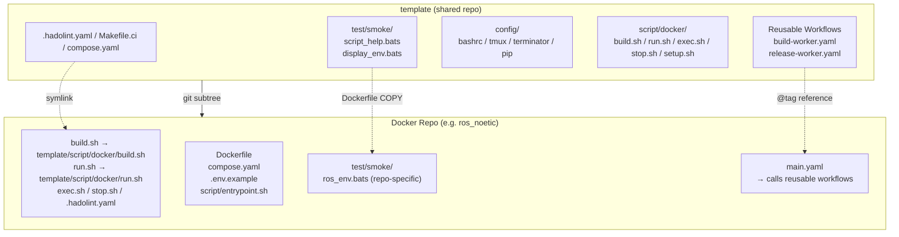
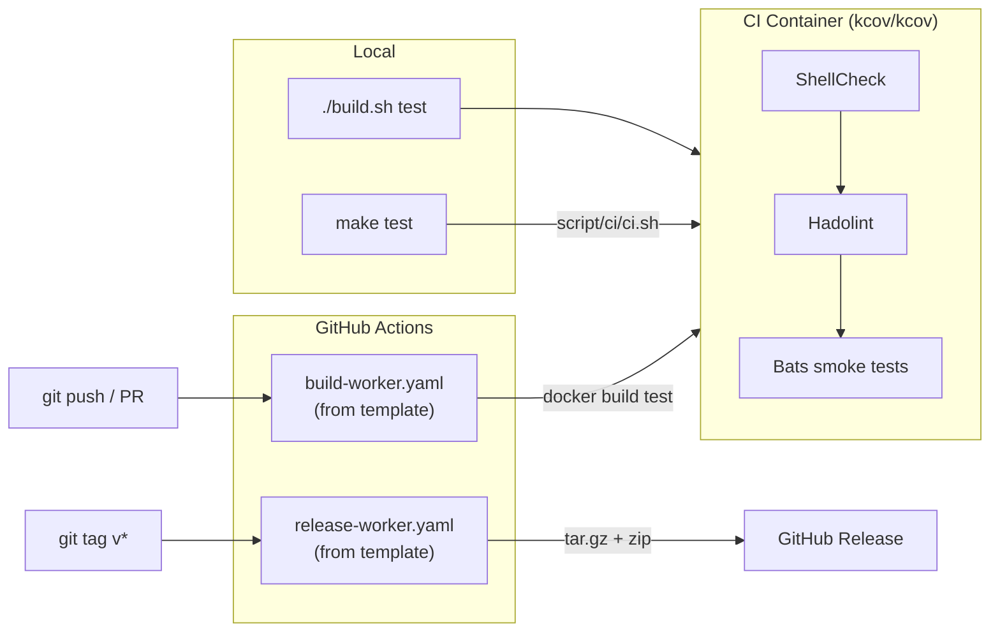

# template

[](https://github.com/ycpss91255-docker/template/actions/workflows/self-test.yaml)
[](https://codecov.io/gh/ycpss91255-docker/template)


[](./LICENSE)

Shared template for Docker container repos in the [ycpss91255-docker](https://github.com/ycpss91255-docker) organization.

**[English](README.md)** | **[繁體中文](doc/readme/README.zh-TW.md)** | **[简体中文](doc/readme/README.zh-CN.md)** | **[日本語](doc/readme/README.ja.md)**

---

## Table of Contents

- [TL;DR](#tldr)
- [Overview](#overview)
- [Quick Start](#quick-start)
- [CI Reusable Workflows](#ci-reusable-workflows)
- [Running Template Tests](#running-template-tests)
- [Tests](#tests)
- [Directory Structure](#directory-structure)

---

## TL;DR

```bash
# New repo: add subtree + init
git subtree add --prefix=template \
    git@github.com:ycpss91255-docker/template.git main --squash
./template/init.sh

# Upgrade to latest
make upgrade-check   # check
make upgrade         # pull + update version + workflow tag

# Run CI
make test            # ShellCheck + Bats + Kcov
make help            # show all commands
```

## Overview

This repo consolidates shared scripts, tests, and CI workflows used across all Docker container repos. Instead of maintaining identical files in 15+ repos, each repo pulls this template as a **git subtree** and uses symlinks.

### Architecture



### CI/CD Flow



### What's included

| File | Description |
|------|-------------|
| `build.sh` | Build containers (calls `script/docker/setup.sh` for `.env` generation) |
| `run.sh` | Run containers (X11/Wayland support) |
| `exec.sh` | Exec into running containers |
| `stop.sh` | Stop and remove containers |
| `script/docker/setup.sh` | Auto-detect system parameters and generate `.env` |
| `script/docker/_lib.sh` | Shared helpers (`_load_env`, `_compose`, `_compose_project`, ...) |
| `script/docker/i18n.sh` | Shared language detection (`_detect_lang`, `_LANG`) |
| `config/` | Container-internal shell configs (bashrc, tmux, terminator, pip) |
| `setup.conf` | Single per-repo runtime configuration (image_name / gpu / gui / network / volumes) |
| `test/smoke/` | Shared smoke tests + runtime assertion helpers (see below) |
| `test/unit/` | Template self-tests (bats + kcov) |
| `test/integration/` | Level-1 `init.sh` end-to-end tests |
| `.hadolint.yaml` | Shared Hadolint rules |
| `Makefile` | Repo entry (`make build`, `make run`, `make stop`, etc.) |
| `Makefile.ci` | Template CI entry (`make test`, `make -f Makefile.ci lint`, etc.) |
| `init.sh` | First-time symlink setup + new-repo scaffolding |
| `upgrade.sh` | Subtree version upgrade |
| `script/ci/ci.sh` | CI pipeline (local + remote) |
| `dockerfile/Dockerfile.example` | Multi-stage Dockerfile template for new repos |
| `dockerfile/Dockerfile.test-tools` | Pre-built lint/test tools image (shellcheck, hadolint, bats, bats-mock) |
| `.github/workflows/` | Reusable CI workflows (build + release) |

### Dockerfile stages (convention)

Downstream repos follow a standard multi-stage layout, defined in
`dockerfile/Dockerfile.example`. All stages share a common base image
parameterized by `ARG BASE_IMAGE`.

| Stage | Parent | Purpose | Shipped? |
|-------|--------|---------|----------|
| `sys` | `${BASE_IMAGE}` | User/group, sudo, timezone, locale, APT mirror | intermediate |
| `base` | `sys` | Development tools and language packages | intermediate |
| `devel` | `base` | App-specific tools + `entrypoint.sh` + PlotJuggler (env repos) | **yes** (primary artifact) |
| `test` | `devel` | Ephemeral: ShellCheck + Hadolint + Bats smoke (all from `test-tools:local`) | no (discarded) |
| `runtime-base` (optional) | `sys` | Minimal runtime deps (sudo, tini) | intermediate |
| `runtime` (optional) | `runtime-base` | Slim runtime image (application repos only) | yes, when enabled |

Notes:
- Repos that only ship a developer image (`env/*`) skip `runtime-base` /
  `runtime` — the section stays commented in `Dockerfile.example`.
- `test` is always built from `devel`, so runtime assertions inside
  `test/smoke/<repo>_env.bats` see the same binaries / files a user would
  find after `docker run ... <repo>:devel`.
- `Dockerfile.test-tools` builds a separate `test-tools:local` image (not
  part of the stage chain above) that the `test` stage copies bats /
  shellcheck / hadolint binaries from via `COPY --from=test-tools:local`.

### Smoke test helpers (for downstream repos)

`test/smoke/test_helper.bash` (loaded by every smoke spec via
`load "${BATS_TEST_DIRNAME}/test_helper"`) ships a small set of runtime
assertion helpers. Downstream repos should prefer these over ad-hoc
`[ -f ... ]` / `command -v` checks so failures produce decorated
diagnostics pointing at the missing artifact.

| Helper | Usage |
|--------|-------|
| `assert_cmd_installed <cmd>` | Fails unless `<cmd>` is on `PATH` |
| `assert_cmd_runs <cmd> [flag]` | Fails unless `<cmd> <flag>` exits 0 (default flag: `--version`) |
| `assert_file_exists <path>` | Fails unless `<path>` is a regular file |
| `assert_dir_exists <path>` | Fails unless `<path>` is a directory |
| `assert_file_owned_by <user> <path>` | Fails unless `<path>`'s owner is `<user>` |
| `assert_pip_pkg <pkg>` | Fails unless `pip show <pkg>` returns 0 |

### What stays in each repo (not shared)

- `Dockerfile`
- `compose.yaml`
- `.env.example`
- `script/entrypoint.sh`
- `doc/` and `README.md`
- Repo-specific smoke tests

## Per-repo runtime configuration

Each downstream repo drives its runtime config — GPU reservation, GUI
env/volumes, network mode, extra volume mounts — through a single
`setup.conf` INI file. `setup.sh` reads it (plus system detection) and
regenerates both `.env` and `compose.yaml`; users never hand-edit those
two derived artifacts.

### One conf, five sections

```
[image_name]   rules = @env_example, prefix:docker_, suffix:_ws, @default:unknown
[gpu]          mode (auto|force|off), count, capabilities
[gui]          mode (auto|force|off)
[network]      mode (host|bridge|none), ipc, privileged
[volumes]      mount_1..mount_N extra host mounts (includes /dev pass-through)
```

Template default lives at `template/setup.conf`; per-repo overrides go
at `<repo>/setup.conf`. Section-level **replace** strategy: a section
present in the per-repo file fully replaces the template's section;
omitted sections fall back to template.

Generate a per-repo override scaffold with:

```bash
./template/init.sh --gen-conf          # copies template/setup.conf to <repo>/setup.conf
./template/init.sh --gen-image-conf    # back-compat alias
```

### When setup.sh runs

`setup.sh` runs only when explicitly triggered — it is not re-run on
every build or launch:

- **`./template/init.sh`** runs it once after the skeleton lands
- **`./build.sh --setup` / `./run.sh --setup`** (or `-s`) re-runs it on demand
- **First-time bootstrap**: `./build.sh` / `./run.sh` auto-run setup.sh
  the very first time (when `.env` is missing, e.g. after a fresh CI
  clone) — no manual `--setup` needed

### Drift detection

`setup.sh` stores `SETUP_CONF_HASH`, `SETUP_GUI_DETECTED`, and
`SETUP_TIMESTAMP` in `.env`. On every `./build.sh` / `./run.sh`,
stored values are compared against the current setup.conf hash + system
detection; a `[WARNING]` is printed (non-blocking) when any of the
following changed since last setup:

- `setup.conf` contents (conf hash)
- GPU / GUI detection
- `USER_UID` (user identity change)

Re-run with `--setup` to regenerate `.env` + `compose.yaml`.

### Derived artifacts (gitignored)

- `.env` — runtime variable values + `SETUP_*` drift metadata
- `compose.yaml` — full compose with baseline + conditional blocks

Open `compose.yaml` anytime to inspect the repo's current effective
configuration.

## Quick Start

### Adding to a new repo

```bash
# 1. Add subtree
git subtree add --prefix=template \
    git@github.com:ycpss91255-docker/template.git main --squash

# 2. Initialize symlinks (one command; runs setup.sh under the hood)
./template/init.sh
```

### Updating

```bash
# Check if update available
make upgrade-check

# Upgrade to latest (subtree pull + version file + workflow tag)
make upgrade

# Or specify a version
./template/upgrade.sh v0.3.0
```

## CI Reusable Workflows

Repos replace local `build-worker.yaml` / `release-worker.yaml` with calls to this repo's reusable workflows:

```yaml
# .github/workflows/main.yaml
jobs:
  call-docker-build:
    uses: ycpss91255-docker/template/.github/workflows/build-worker.yaml@v1
    with:
      image_name: ros_noetic
      build_args: |
        ROS_DISTRO=noetic
        ROS_TAG=ros-base
        UBUNTU_CODENAME=focal

  call-release:
    needs: call-docker-build
    if: startsWith(github.ref, 'refs/tags/')
    uses: ycpss91255-docker/template/.github/workflows/release-worker.yaml@v1
    with:
      archive_name_prefix: ros_noetic
```

### build-worker.yaml inputs

| Input | Type | Required | Default | Description |
|-------|------|----------|---------|-------------|
| `image_name` | string | yes | - | Container image name |
| `build_args` | string | no | `""` | Multi-line KEY=VALUE build args |
| `build_runtime` | boolean | no | `true` | Whether to build runtime stage |

### release-worker.yaml inputs

| Input | Type | Required | Default | Description |
|-------|------|----------|---------|-------------|
| `archive_name_prefix` | string | yes | - | Archive name prefix |
| `extra_files` | string | no | `""` | Space-separated extra files |

## Running Template Tests

Using `Makefile.ci` (from template root):
```bash
make -f Makefile.ci test        # Full CI (ShellCheck + Bats + Kcov) via docker compose
make -f Makefile.ci lint        # ShellCheck only
make -f Makefile.ci clean       # Remove coverage reports
make help        # Show repo targets
make -f Makefile.ci help  # Show CI targets
```

Or directly:
```bash
./script/ci/ci.sh          # Full CI via docker compose
./script/ci/ci.sh --ci     # Run inside container (used by compose)
```

## Tests

See [TEST.md](doc/test/TEST.md) for details.

## Directory Structure

```
template/
├── init.sh                           # Initialize repo (new or existing)
├── upgrade.sh                        # Upgrade template subtree version
├── script/
│   ├── docker/                       # Docker operation scripts (symlinked by repos)
│   │   ├── build.sh
│   │   ├── run.sh
│   │   ├── exec.sh
│   │   ├── stop.sh
│   │   ├── setup.sh                  # .env generator
│   │   ├── _lib.sh                   # Shared helpers (_load_env, _compose, _compose_project)
│   │   ├── i18n.sh                   # Shared language detection (_detect_lang, _LANG)
│   │   └── Makefile
│   └── ci/
│       └── ci.sh                     # CI pipeline (local + remote)
├── dockerfile/
│   ├── Dockerfile.test-tools         # Pre-built lint/test tools image
│   └── Dockerfile.example            # Dockerfile template for new repos (sys → base → devel → test → [runtime])
├── setup.conf                        # Single runtime config (per-repo override mirror: <repo>/setup.conf)
├── config/                           # Container-internal shell/tool configs
│   ├── image_name.conf               # Default IMAGE_NAME detection rules
│   ├── pip/
│   │   ├── setup.sh
│   │   └── requirements.txt
│   └── shell/
│       ├── bashrc
│       ├── terminator/
│       │   ├── setup.sh
│       │   └── config
│       └── tmux/
│           ├── setup.sh
│           └── tmux.conf
├── test/
│   ├── smoke/                        # Shared smoke tests + runtime assertion helpers
│   │   ├── test_helper.bash          #  → assert_cmd_installed / _runs / file / dir / owned_by / pip_pkg
│   │   ├── script_help.bats
│   │   └── display_env.bats
│   ├── unit/                         # Template self-tests (bats + kcov)
│   │   ├── test_helper.bash
│   │   ├── bashrc_spec.bats
│   │   ├── ci_spec.bats              # ci.sh _install_deps
│   │   ├── lib_spec.bats             # _lib.sh
│   │   ├── pip_setup_spec.bats
│   │   ├── setup_spec.bats
│   │   ├── smoke_helper_spec.bats    # Runtime assertion helpers
│   │   ├── template_spec.bats
│   │   ├── terminator_config_spec.bats
│   │   ├── terminator_setup_spec.bats
│   │   ├── tmux_conf_spec.bats
│   │   └── tmux_setup_spec.bats
│   └── integration/
│       └── init_new_repo_spec.bats   # Level-1 init.sh end-to-end
├── Makefile.ci                       # Template CI entry (make test/lint/...)
├── compose.yaml                      # Docker CI runner
├── .hadolint.yaml                    # Shared Hadolint rules
├── codecov.yml
├── .github/workflows/
│   ├── self-test.yaml                # Template CI
│   ├── build-worker.yaml             # Reusable build workflow
│   └── release-worker.yaml           # Reusable release workflow
├── doc/
│   ├── readme/                       # README translations (zh-TW / zh-CN / ja)
│   ├── test/TEST.md                  # Test catalog (spec tables)
│   └── changelog/CHANGELOG.md        # Release notes
├── .gitignore
├── LICENSE
└── README.md
```
