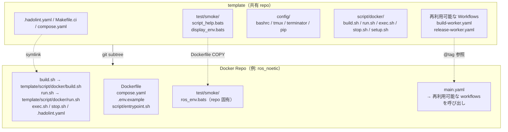
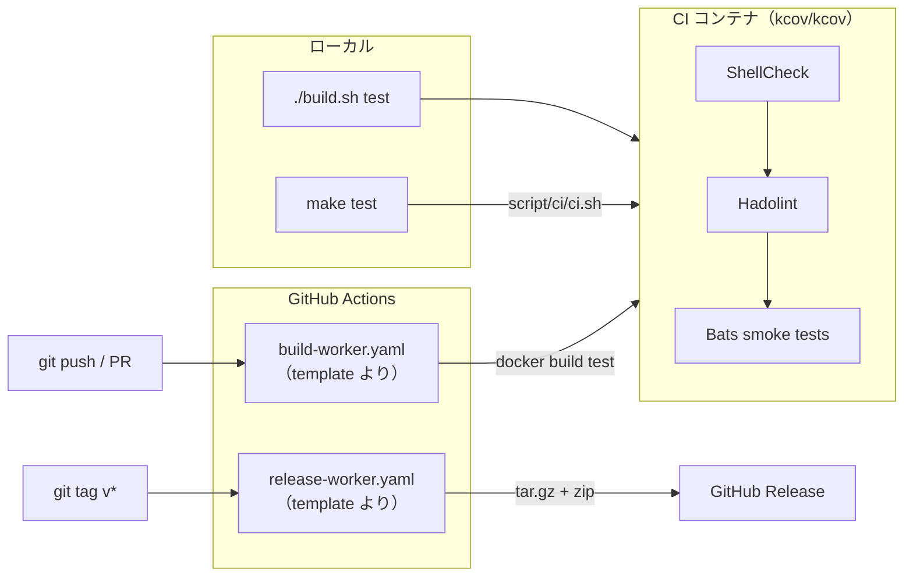

# template

[](https://github.com/ycpss91255-docker/template/actions/workflows/self-test.yaml)
[](https://codecov.io/gh/ycpss91255-docker/template)


[](./LICENSE)

[ycpss91255-docker](https://github.com/ycpss91255-docker) 組織のすべての Docker コンテナ repo 用共有テンプレート。

**[English](../../README.md)** | **[繁體中文](README.zh-TW.md)** | **[简体中文](README.zh-CN.md)** | **[日本語](README.ja.md)**

---

## 目次

- [TL;DR](#tldr)
- [概要](#概要)
- [クイックスタート](#クイックスタート)
- [CI Reusable Workflows](#ci-reusable-workflows)
- [ローカルテスト実行](#ローカルテスト実行)
- [テスト](#テスト)
- [ディレクトリ構造](#ディレクトリ構造)

---

## TL;DR

```bash
# ゼロからの新規 repo：init + 初回コミット + subtree + init.sh
mkdir <repo_name> && cd <repo_name>
git init
git commit --allow-empty -m "chore: initial commit"
git subtree add --prefix=template \
    https://github.com/ycpss91255-docker/template.git main --squash
./template/init.sh

# 最新版にアップグレード
make upgrade-check   # 確認
make upgrade         # pull + バージョンファイル + workflow tag 更新

# CI 実行
make test            # ShellCheck + Bats + Kcov
make help            # 全コマンド表示
```

## 概要

本 repo は、すべての Docker コンテナ repo で共有されるスクリプト、テスト、CI workflow を一元管理しています。15 以上の repo で同一ファイルを個別管理する代わりに、各 repo が **git subtree** としてこのテンプレートを取り込み、symlink で参照します。

### アーキテクチャ



### CI/CD フロー



### 含まれるもの

| ファイル | 説明 |
|----------|------|
| `build.sh` | コンテナビルド（`--setup` は TTY がある場合 `setup_tui.sh` を起動、無ければ `setup.sh` を実行） |
| `run.sh` | コンテナ実行（X11/Wayland 対応；`--setup` の意味は `build.sh` と同じ） |
| `exec.sh` | 実行中のコンテナに入る |
| `stop.sh` | コンテナの停止・削除 |
| `setup_tui.sh` | インタラクティブな setup.conf エディタ（dialog / whiptail フロントエンド） |
| `script/docker/setup.sh` | システムパラメータの自動検出と `.env` + `compose.yaml` 生成 |
| `script/docker/_tui_backend.sh` | `setup_tui.sh` が使用する dialog / whiptail ラッパ関数 |
| `script/docker/_tui_conf.sh` | INI バリデータ + 読み書き（`setup_tui.sh` と `setup.sh` の書き戻し用） |
| `script/docker/_lib.sh` | 共有 helper（`_load_env`、`_compose`、`_compose_project` など） |
| `script/docker/i18n.sh` | 共有言語検出（`_detect_lang`、`_LANG`） |
| `config/` | コンテナ内部のシェル設定ファイル（bashrc、tmux、terminator、pip） |
| `setup.conf` | 単一の repo ランタイム設定（image / build / deploy / gui / network / volumes） |
| `test/smoke/` | 共有 smoke テスト + runtime assertion helpers（下記参照） |
| `test/unit/` | Template 自身のテスト（bats + kcov） |
| `test/integration/` | Level-1 `init.sh` 統合テスト |
| `.hadolint.yaml` | 共有 Hadolint ルール |
| `Makefile` | Repo コマンドエントリ（`make build`、`make run`、`make stop` 等） |
| `Makefile.ci` | Template CI コマンドエントリ（`make test`、`make lint` 等） |
| `init.sh` | 初回 symlink セットアップ + 新 repo スケルトン生成 |
| `upgrade.sh` | Subtree バージョンアップグレード |
| `script/ci/ci.sh` | CI パイプライン（ローカル + リモート） |
| `dockerfile/Dockerfile.example` | 新 repo のマルチステージ Dockerfile テンプレート |
| `dockerfile/Dockerfile.test-tools` | プリビルド lint/test ツール image（shellcheck、hadolint、bats、bats-mock） |
| `.github/workflows/` | 再利用可能な CI workflows（build + release） |

### Dockerfile ステージ（規約）

ダウンストリーム repo は `dockerfile/Dockerfile.example` で定義される標準のマルチステージ構成に従います。
すべてのステージは `ARG BASE_IMAGE` で指定されるベース image を共有します。

| ステージ | 親ステージ | 用途 | 出荷 |
|----------|------------|------|------|
| `sys` | `${BASE_IMAGE}` | ユーザー/グループ、sudo、タイムゾーン、ロケール、APT mirror | 中間 |
| `base` | `sys` | 開発ツールと言語パッケージ | 中間 |
| `devel` | `base` | アプリ固有ツール + `entrypoint.sh` + PlotJuggler（env repos） | **はい**（主成果物） |
| `test` | `devel` | 一時的：ShellCheck + Hadolint + Bats smoke（いずれも `test-tools:local` から） | いいえ（build 後破棄） |
| `runtime-base`（任意） | `sys` | 最小 runtime 依存（sudo、tini） | 中間 |
| `runtime`（任意） | `runtime-base` | 軽量 runtime image（application repos で使用） | 有効時に出荷 |

補足：
- developer image のみを出荷する repo（`env/*`）は `runtime-base` /
  `runtime` をスキップし、該当セクションは `Dockerfile.example` 内で
  コメントアウトしたままにします。
- `test` は常に `devel` を継承するため、`test/smoke/<repo>_env.bats` の
  runtime assertion が確認するバイナリやファイルは、ユーザーが
  `docker run ... <repo>:devel` で目にするものと一致します。
- `Dockerfile.test-tools` は別途 `test-tools:local` image をビルドし
  （上記ステージ連鎖には含まれません）、`test` ステージが
  `COPY --from=test-tools:local` で bats / shellcheck / hadolint
  バイナリを取り込みます。

### Smoke test ヘルパー（ダウンストリーム repo 用）

`test/smoke/test_helper.bash`（各 smoke spec が
`load "${BATS_TEST_DIRNAME}/test_helper"` で読み込み）が runtime
assertion helpers のセットを提供します。ダウンストリーム repo は
素の `[ -f ... ]` / `command -v` より優先してこれらの helper を使用
すべきです。失敗時は欠落している成果物を直接指し示す decorated な
診断メッセージを出力します。

| Helper | 用法 |
|--------|------|
| `assert_cmd_installed <cmd>` | `<cmd>` が `PATH` 上にない場合に失敗 |
| `assert_cmd_runs <cmd> [flag]` | `<cmd> <flag>` が 0 以外で終了した場合に失敗（flag のデフォルトは `--version`） |
| `assert_file_exists <path>` | `<path>` が通常ファイルでない場合に失敗 |
| `assert_dir_exists <path>` | `<path>` がディレクトリでない場合に失敗 |
| `assert_file_owned_by <user> <path>` | `<path>` の所有者が `<user>` でない場合に失敗 |
| `assert_pip_pkg <pkg>` | `pip show <pkg>` が 0 以外で終了した場合に失敗 |

### 各 repo で個別管理するファイル（共有しない）

- `Dockerfile`
- `compose.yaml`
- `.env.example`
- `script/entrypoint.sh`
- `doc/` と `README.md`
- Repo 固有の smoke test

## repo ごとのランタイム設定

各下流 repo は 1 つの `setup.conf` INI ファイルで自身のランタイム設定
（GPU 予約 / GUI env/volumes / network mode / 追加 volume mounts）を
駆動します。`setup.sh` がこれ + システム検出結果を読み、`.env` と
`compose.yaml` を再生成します — この 2 つの生成物をユーザが手動編集
する必要はありません。

### 単一 conf、6 つの section

```
[image]    rules = prefix:docker_, suffix:_ws, @default:unknown
[build]    apt_mirror_ubuntu、apt_mirror_debian            # Dockerfile build args
[deploy]   gpu_mode (auto|force|off)、gpu_count、gpu_capabilities
[gui]      mode (auto|force|off)
[network]  mode (host|bridge|none)、ipc、privileged
[volumes]  mount_1（workspace、初回 setup.sh 実行時に自動記入）
           mount_2..mount_N（ユーザ定義の追加 host mount；/dev デバイスは path 指定）
```

テンプレート既定値は `template/setup.conf`；repo ごとの上書きは
`<repo>/setup.conf`。セクションレベル **replace** 戦略：repo ファイルに
section があれば template の section を全置換；無ければ template 既定値を継承。

初回の `setup.sh` 実行時（repo 側の setup.conf がまだ無い状態）、
template ファイルが repo にコピーされ、検出された workspace が
`[volumes] mount_1` に書き込まれます。以降の実行は `mount_1` を
真のソースとして扱います — 空にすれば workspace マウントを
オプトアウトできます。編集方法：

```bash
./setup_tui.sh                      # インタラクティブな dialog/whiptail エディタ
./setup_tui.sh volumes              # 特定 section に直接ジャンプ
./build.sh --setup            # TTY 下では setup_tui.sh を起動、それ以外は setup.sh を実行
./template/init.sh --gen-conf # template/setup.conf を repo ルートに単純コピー
```

### インタラクティブ TUI

`./setup_tui.sh` はメインメニューを開き、6 つの section すべての値を
編集できます。バックエンドは `dialog` または `whiptail`（どちらも
無い場合は `sudo apt install dialog` のヒントを表示して終了）。
Cancel / Esc で保存せず退出；保存後は自動的に `setup.sh` を呼び
出して `.env` + `compose.yaml` を再生成します。

### setup.sh の実行タイミング

`setup.sh` は明示的にトリガーされた時のみ実行されます — build / run
の度に再実行されることはありません：

- **`./template/init.sh`** がスケルトン生成後に 1 回自動実行
- **`./build.sh --setup` / `./run.sh --setup`**（または `-s`）— ユーザが
  明示的に再実行。TTY がある場合は先に `setup_tui.sh` を起動して `setup.conf`
  を編集させ、TTY が無い場合は直接 `setup.sh` を呼び出します
- **初回 bootstrap**：`./build.sh` / `./run.sh` は `.env` が無い初回実行
  （CI の新規 clone 等）では、同じ TTY-aware フローを自動で通ります。
  `--setup` 指定は不要

### ドリフト検出

`setup.sh` は `.env` に `SETUP_CONF_HASH` / `SETUP_GUI_DETECTED` /
`SETUP_TIMESTAMP` を書き込みます。`./build.sh` / `./run.sh` は毎回
エントリ時点で現行の `setup.conf` ハッシュ + システム検出値と比較し、
以下のいずれかが変化した場合に `[WARNING]` を出力（実行は継続）：

- `setup.conf` の内容（conf hash）
- GPU / GUI の検出結果
- `USER_UID`（ユーザ ID の変化）

`--setup` を付けて再実行すれば `.env` + `compose.yaml` を再生成できます。

### 生成物（gitignored）

- `.env` — ランタイム変数 + `SETUP_*` drift metadata
- `compose.yaml` — baseline + 条件ブロック込みの完全な compose

いつでも `compose.yaml` を開けば現在の完全なランタイム設定を確認できます。

## クイックスタート

### 新規 repo への追加

```bash
# 1. 空の repo を初期化（既存の repo でコミットが 1 つ以上ある場合はスキップ）
mkdir <repo_name> && cd <repo_name>
git init
git commit --allow-empty -m "chore: initial commit"

# 2. subtree 追加
git subtree add --prefix=template \
    https://github.com/ycpss91255-docker/template.git main --squash

# 3. symlink 初期化（ワンコマンド）
./template/init.sh
```

> `git subtree add` は `HEAD` の存在を前提とします。`git init` 直後でコミットが無い repo では `ambiguous argument 'HEAD'` と `working tree has modifications` で失敗します。空コミットで `HEAD` を作成しておけば subtree がマージできます。

### アップグレード

```bash
# 新バージョンの確認
make upgrade-check

# 最新にアップグレード（subtree pull + バージョンファイル + workflow tag）
make upgrade

# バージョン指定
./template/upgrade.sh v0.3.0
```

## CI Reusable Workflows

各 repo のローカル `build-worker.yaml` / `release-worker.yaml` を、本 repo の reusable workflows 呼び出しに置き換えます：

```yaml
# .github/workflows/main.yaml
jobs:
  call-docker-build:
    uses: ycpss91255-docker/template/.github/workflows/build-worker.yaml@v1
    with:
      image_name: ros_noetic
      build_args: |
        ROS_DISTRO=noetic
        ROS_TAG=ros-base
        UBUNTU_CODENAME=focal

  call-release:
    needs: call-docker-build
    if: startsWith(github.ref, 'refs/tags/')
    uses: ycpss91255-docker/template/.github/workflows/release-worker.yaml@v1
    with:
      archive_name_prefix: ros_noetic
```

### build-worker.yaml パラメータ

| パラメータ | 型 | 必須 | デフォルト | 説明 |
|------------|------|------|------------|------|
| `image_name` | string | はい | - | コンテナイメージ名 |
| `build_args` | string | いいえ | `""` | 複数行 KEY=VALUE ビルド引数 |
| `build_runtime` | boolean | いいえ | `true` | runtime stage をビルドするか |

### release-worker.yaml パラメータ

| パラメータ | 型 | 必須 | デフォルト | 説明 |
|------------|------|------|------------|------|
| `archive_name_prefix` | string | はい | - | アーカイブ名プレフィックス |
| `extra_files` | string | いいえ | `""` | 追加ファイル（スペース区切り） |

## ローカルテスト実行

`Makefile.ci`（template ルートから）を使用：
```bash
make -f Makefile.ci test        # フル CI（ShellCheck + Bats + Kcov）docker compose 経由
make -f Makefile.ci lint        # ShellCheck のみ
make -f Makefile.ci clean       # カバレッジレポート削除
make help        # repo ターゲット表示
make -f Makefile.ci help  # CI ターゲット表示
```

直接実行：
```bash
./script/ci/ci.sh          # フル CI（docker compose 経由）
./script/ci/ci.sh --ci     # コンテナ内で実行（compose から呼び出し）
```

## テスト

詳細は [TEST.md](../test/TEST.md) を参照。

## ディレクトリ構造

```
template/
├── init.sh                           # repo 初期化（新規または既存）
├── upgrade.sh                        # template subtree バージョンアップグレード
├── script/
│   ├── docker/                       # Docker 操作スクリプト（各 repo symlink）
│   │   ├── build.sh
│   │   ├── run.sh
│   │   ├── exec.sh
│   │   ├── stop.sh
│   │   ├── setup_tui.sh                    # インタラクティブな setup.conf エディタ（dialog/whiptail）
│   │   ├── setup.sh                  # .env + compose.yaml ジェネレータ
│   │   ├── _tui_backend.sh           # dialog / whiptail ラッパ関数
│   │   ├── _tui_conf.sh              # INI バリデータ + 読み書き
│   │   ├── _lib.sh                   # 共有 helper（_load_env、_compose、_compose_project）
│   │   ├── i18n.sh                   # 共有言語検出（_detect_lang、_LANG）
│   │   └── Makefile
│   └── ci/
│       └── ci.sh                     # CI パイプライン（ローカル + リモート）
├── dockerfile/
│   ├── Dockerfile.test-tools         # プリビルド lint/test ツール image
│   └── Dockerfile.example            # 新 repo の Dockerfile テンプレート（sys → base → devel → test → [runtime]）
├── setup.conf                        # 単一ランタイム設定（repo 上書き: <repo>/setup.conf）
├── config/                           # コンテナ内部のシェル / ツール設定
│   ├── image_name.conf               # デフォルト IMAGE_NAME 検出ルール
│   ├── pip/
│   │   ├── setup.sh
│   │   └── requirements.txt
│   └── shell/
│       ├── bashrc
│       ├── terminator/
│       │   ├── setup.sh
│       │   └── config
│       └── tmux/
│           ├── setup.sh
│           └── tmux.conf
├── test/
│   ├── smoke/                        # 共有 smoke テスト + runtime assertion helpers
│   │   ├── test_helper.bash          #  → assert_cmd_installed / _runs / file / dir / owned_by / pip_pkg
│   │   ├── script_help.bats
│   │   └── display_env.bats
│   ├── unit/                         # テンプレート自身のテスト（bats + kcov）
│   │   ├── test_helper.bash
│   │   ├── bashrc_spec.bats
│   │   ├── ci_spec.bats              # ci.sh _install_deps
│   │   ├── lib_spec.bats             # _lib.sh
│   │   ├── pip_setup_spec.bats
│   │   ├── setup_spec.bats
│   │   ├── smoke_helper_spec.bats    # Runtime assertion helpers
│   │   ├── template_spec.bats
│   │   ├── terminator_config_spec.bats
│   │   ├── terminator_setup_spec.bats
│   │   ├── tmux_conf_spec.bats
│   │   └── tmux_setup_spec.bats
│   └── integration/
│       └── init_new_repo_spec.bats   # Level-1 init.sh 統合テスト
├── Makefile.ci                       # テンプレート CI エントリ（make test/lint/...）
├── compose.yaml                      # Docker CI ランナー
├── .hadolint.yaml                    # 共有 Hadolint ルール
├── codecov.yml
├── .github/workflows/
│   ├── self-test.yaml                # テンプレート CI
│   ├── build-worker.yaml             # 再利用可能なビルド workflow
│   └── release-worker.yaml           # 再利用可能なリリース workflow
├── doc/
│   ├── readme/                       # README 翻訳（zh-TW / zh-CN / ja）
│   ├── test/TEST.md                  # テスト一覧
│   └── changelog/CHANGELOG.md        # リリース記録
├── .gitignore
├── LICENSE
└── README.md
```
