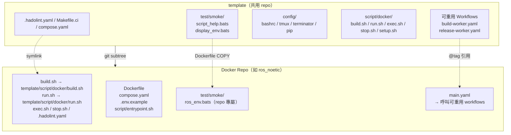
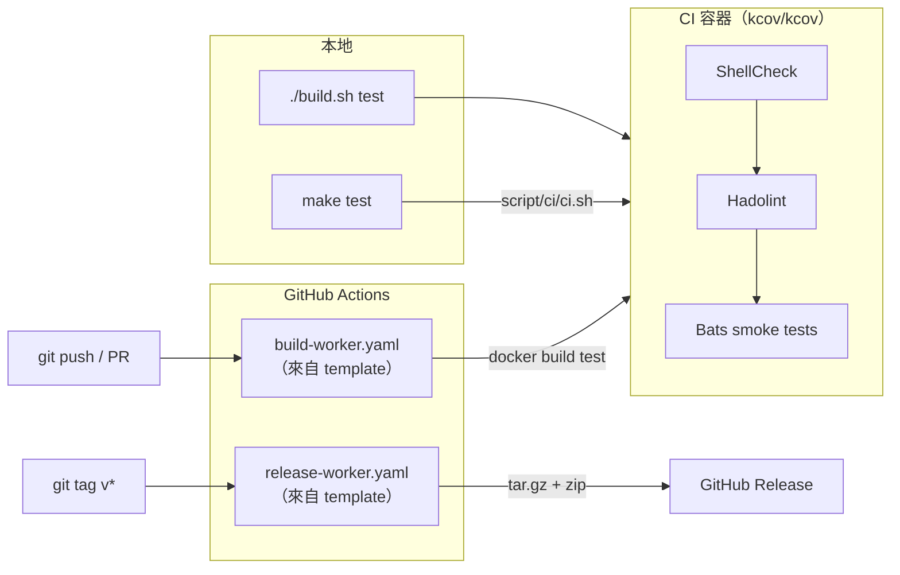

# template

[](https://github.com/ycpss91255-docker/template/actions/workflows/self-test.yaml)
[](https://codecov.io/gh/ycpss91255-docker/template)


[](./LICENSE)

[ycpss91255-docker](https://github.com/ycpss91255-docker) 組織下所有 Docker 容器 repo 的共用模板。

**[English](../../README.md)** | **[繁體中文](README.zh-TW.md)** | **[简体中文](README.zh-CN.md)** | **[日本語](README.ja.md)**

---

## 目錄

- [TL;DR](#tldr)
- [概述](#概述)
- [快速開始](#快速開始)
- [CI Reusable Workflows](#ci-reusable-workflows)
- [本地執行測試](#本地執行測試)
- [測試](#測試)
- [目錄結構](#目錄結構)

---

## TL;DR

```bash
# 從零開始的新 repo：init + 首個 commit + subtree + init.sh
mkdir <repo_name> && cd <repo_name>
git init
git commit --allow-empty -m "chore: initial commit"
git subtree add --prefix=template \
    https://github.com/ycpss91255-docker/template.git main --squash
./template/init.sh

# 升級到最新版
make upgrade-check   # 檢查
make upgrade         # pull + 更新版本檔 + workflow tag

# 執行 CI
make test            # ShellCheck + Bats + Kcov
make help            # 顯示所有指令
```

## 概述

此 repo 集中管理所有 Docker 容器 repo 共用的腳本、測試和 CI workflow。各 repo 透過 **git subtree** 拉入此模板，並使用 symlink 引用共用檔案。

### 架構



### CI/CD 流程



### 包含內容

| 檔案 | 說明 |
|------|------|
| `build.sh` | 建置容器（`--setup` 有 TTY 時啟動 `setup_tui.sh`，否則呼叫 `setup.sh`） |
| `run.sh` | 執行容器（支援 X11/Wayland；`--setup` 語意與 `build.sh` 相同） |
| `exec.sh` | 進入執行中的容器 |
| `stop.sh` | 停止並移除容器 |
| `setup_tui.sh` | 互動式 setup.conf 編輯器（dialog / whiptail 前端） |
| `script/docker/setup.sh` | 自動偵測系統參數並產生 `.env` + `compose.yaml` |
| `script/docker/_tui_backend.sh` | `setup_tui.sh` 使用的 dialog / whiptail 包裝函式 |
| `script/docker/_tui_conf.sh` | INI validator + 讀寫邏輯（供 `setup_tui.sh` 及 `setup.sh` 回寫使用） |
| `script/docker/_lib.sh` | 共用 helper（`_load_env`、`_compose`、`_compose_project` 等） |
| `script/docker/i18n.sh` | 共用語言偵測（`_detect_lang`、`_LANG`） |
| `config/` | Container 內部 shell 設定檔（bashrc、tmux、terminator、pip） |
| `setup.conf` | 單一 per-repo runtime 配置（image / build / deploy / gui / network / volumes） |
| `test/smoke/` | 共用 smoke 測試 + runtime assertion helpers（見下方） |
| `test/unit/` | Template 自身測試（bats + kcov） |
| `test/integration/` | Level-1 `init.sh` 整合測試 |
| `.hadolint.yaml` | 共用 Hadolint 規則 |
| `Makefile` | Repo 指令入口（`make build`、`make run`、`make stop` 等） |
| `Makefile.ci` | Template CI 指令入口（`make test`、`make lint` 等） |
| `init.sh` | 首次初始化 symlinks + 新 repo 骨架產生 |
| `upgrade.sh` | Subtree 版本升級 |
| `script/ci/ci.sh` | CI pipeline（本地 + 遠端） |
| `dockerfile/Dockerfile.example` | 新 repo 的多階段 Dockerfile 範本 |
| `dockerfile/Dockerfile.test-tools` | 預建置 lint/test 工具 image（shellcheck、hadolint、bats、bats-mock） |
| `.github/workflows/` | 可重用 CI workflows（build + release） |

### Dockerfile 分層（慣例）

下游 repo 遵循標準多階段配置，定義於 `dockerfile/Dockerfile.example`。
所有階段共用 `ARG BASE_IMAGE` 指定的基礎映像。

| 階段 | 父階段 | 用途 | 是否出貨 |
|------|--------|------|---------|
| `sys` | `${BASE_IMAGE}` | 使用者/群組、sudo、時區、語系、APT mirror | 中介 |
| `base` | `sys` | 開發工具與語言套件 | 中介 |
| `devel` | `base` | 應用專屬工具 + `entrypoint.sh` + PlotJuggler（env repos） | **是**（主要產物） |
| `test` | `devel` | 短暫：ShellCheck + Hadolint + Bats smoke（均來自 `test-tools:local`） | 否（build 完即丟） |
| `runtime-base`（選用） | `sys` | 最小 runtime 相依（sudo、tini） | 中介 |
| `runtime`（選用） | `runtime-base` | 精簡 runtime 映像（application repos 使用） | 啟用時出貨 |

說明：
- 只出貨 developer image 的 repo（`env/*`）會跳過 `runtime-base` /
  `runtime`——該 section 在 `Dockerfile.example` 維持註解狀態。
- `test` 永遠從 `devel` 繼承，所以 `test/smoke/<repo>_env.bats` 裡的
  runtime assertion 所看到的二進位與檔案，就是使用者 `docker run ...
  <repo>:devel` 後會看到的內容。
- `Dockerfile.test-tools` 另外建置一個 `test-tools:local` image（不在
  上面的階段鏈中），`test` 階段透過 `COPY --from=test-tools:local`
  把 bats / shellcheck / hadolint 二進位拉進來。

### Smoke test helpers（供下游 repo 使用）

`test/smoke/test_helper.bash`（每個 smoke spec 透過
`load "${BATS_TEST_DIRNAME}/test_helper"` 載入）提供一組 runtime
assertion helpers。下游 repo 應優先使用這些 helper 而非原生的
`[ -f ... ]` / `command -v`，失敗時會輸出 decorated 診斷訊息直指缺少
的工件。

| Helper | 用法 |
|--------|------|
| `assert_cmd_installed <cmd>` | `<cmd>` 不在 `PATH` 上時失敗 |
| `assert_cmd_runs <cmd> [flag]` | `<cmd> <flag>` 非 0 時失敗（flag 預設 `--version`） |
| `assert_file_exists <path>` | `<path>` 非 regular file 時失敗 |
| `assert_dir_exists <path>` | `<path>` 非目錄時失敗 |
| `assert_file_owned_by <user> <path>` | `<path>` 擁有者不是 `<user>` 時失敗 |
| `assert_pip_pkg <pkg>` | `pip show <pkg>` 非 0 時失敗 |

### 各 repo 自行維護的檔案（不共用）

- `Dockerfile`
- `compose.yaml`
- `.env.example`
- `script/entrypoint.sh`
- `doc/` 和 `README.md`
- Repo 專屬的 smoke test

## 各 repo runtime 配置

每個下游 repo 透過一個 `setup.conf` INI 檔驅動自己的 runtime 配置
（GPU 保留、GUI env/volumes、network mode、額外 volume mounts）。
`setup.sh` 讀它 + 系統偵測後重新產生 `.env` 跟 `compose.yaml`，這
兩個衍生檔使用者不用動手編輯。

### 單一 conf、6 個 section

```
[image]    rules = prefix:docker_, suffix:_ws, @default:unknown
[build]    apt_mirror_ubuntu、apt_mirror_debian            # Dockerfile build args
[deploy]   gpu_mode (auto|force|off)、gpu_count、gpu_capabilities
[gui]      mode (auto|force|off)
[network]  mode (host|bridge|none)、ipc、privileged
[volumes]  mount_1（workspace，首次 setup.sh 執行時自動填入）
           mount_2..mount_N（使用者自訂額外 host mount；/dev 裝置走 path）
```

Template default 在 `template/setup.conf`；per-repo 覆蓋放 `<repo>/setup.conf`。
Section-level **replace** 策略：per-repo 檔若有該 section 就整段取代
template；沒寫的 section 則吃 template 預設。

首次執行 `setup.sh`（尚無 per-repo setup.conf）時，template 檔會被
複製到 repo，並把偵測到的 workspace 寫入 `[volumes] mount_1`。後續
執行以 `mount_1` 為真實來源 — 清空該欄即可放棄掛 workspace。編輯方式：

```bash
./setup_tui.sh                      # 互動式 dialog/whiptail 編輯器
./setup_tui.sh volumes              # 直接跳到指定 section
./build.sh --setup            # 有 TTY 時啟動 setup_tui.sh；無 TTY 時執行 setup.sh
./template/init.sh --gen-conf # 單純複製 template/setup.conf 到 repo 根目錄
```

### 互動式 TUI

`./setup_tui.sh` 開啟主選單，可編輯 6 個 section 全部的值，底層是
`dialog` 或 `whiptail`（兩者都缺時會印出 `sudo apt install dialog`
提示並退出）。按 Cancel / Esc 不存檔離開；存檔後會自動呼叫
`setup.sh` 重新產生 `.env` + `compose.yaml`。

### setup.sh 什麼時候跑

`setup.sh` 只在明確觸發時才執行 — 並不會在每次 build / run 都重跑：

- **`./template/init.sh`** 建完骨架自動跑一次
- **`./build.sh --setup` / `./run.sh --setup`**（或 `-s`）— 使用者手動觸發重跑；
  有 TTY 時先啟動 `setup_tui.sh` 讓使用者修改 `setup.conf`，無 TTY 時直接呼叫 `setup.sh`
- **首次 bootstrap**：`./build.sh` / `./run.sh` 首次執行（`.env` 尚未存在，
  例如 CI 新 clone）會自動走相同的 TTY-aware 流程，不用帶 `--setup`

### Drift 偵測

`setup.sh` 把 `SETUP_CONF_HASH`、`SETUP_GUI_DETECTED`、`SETUP_TIMESTAMP`
寫到 `.env`。每次 `./build.sh` / `./run.sh` 進入時會比對 `setup.conf`
當前 hash + 系統偵測值，以下任一項改變時印 `[WARNING]`（但不阻擋執行）：

- `setup.conf` 內容（conf hash）
- GPU / GUI 偵測結果
- `USER_UID`（使用者身份）

帶 `--setup` 重跑以重新產 `.env` + `compose.yaml`。

### 衍生檔（gitignored）

- `.env` — runtime 變數 + `SETUP_*` drift metadata
- `compose.yaml` — 含 baseline 與條件區塊的完整 compose

任何時候打開 `compose.yaml` 都能看到當下完整 runtime 配置。

## 快速開始

### 加入新 repo

```bash
# 1. 初始化空的 repo（若已有 repo 且至少一個 commit 則跳過）
mkdir <repo_name> && cd <repo_name>
git init
git commit --allow-empty -m "chore: initial commit"

# 2. 加入 subtree
git subtree add --prefix=template \
    https://github.com/ycpss91255-docker/template.git main --squash

# 3. 初始化 symlinks（一個指令搞定）
./template/init.sh
```

> `git subtree add` 需要 `HEAD` 存在。在剛 `git init` 且沒有任何 commit 的 repo 上會報錯 `ambiguous argument 'HEAD'` 與 `working tree has modifications`。用空 commit 建立 `HEAD`，subtree 才能 merge 進來。

### 升級

```bash
# 檢查是否有新版
make upgrade-check

# 升級到最新（subtree pull + 版本檔 + workflow tag）
make upgrade

# 或指定版本
./template/upgrade.sh v0.3.0
```

## CI Reusable Workflows

各 repo 將本地的 `build-worker.yaml` / `release-worker.yaml` 替換為呼叫此 repo 的 reusable workflows：

```yaml
# .github/workflows/main.yaml
jobs:
  call-docker-build:
    uses: ycpss91255-docker/template/.github/workflows/build-worker.yaml@v1
    with:
      image_name: ros_noetic
      build_args: |
        ROS_DISTRO=noetic
        ROS_TAG=ros-base
        UBUNTU_CODENAME=focal

  call-release:
    needs: call-docker-build
    if: startsWith(github.ref, 'refs/tags/')
    uses: ycpss91255-docker/template/.github/workflows/release-worker.yaml@v1
    with:
      archive_name_prefix: ros_noetic
```

### build-worker.yaml 參數

| 參數 | 類型 | 必填 | 預設值 | 說明 |
|------|------|------|--------|------|
| `image_name` | string | 是 | - | 容器映像名稱 |
| `build_args` | string | 否 | `""` | 多行 KEY=VALUE 建置參數 |
| `build_runtime` | boolean | 否 | `true` | 是否建置 runtime stage |

### release-worker.yaml 參數

| 參數 | 類型 | 必填 | 預設值 | 說明 |
|------|------|------|--------|------|
| `archive_name_prefix` | string | 是 | - | Archive 名稱前綴 |
| `extra_files` | string | 否 | `""` | 額外檔案（空格分隔） |

## 本地執行測試

使用 `Makefile.ci`（在 template 根目錄）：
```bash
make -f Makefile.ci test        # 完整 CI（ShellCheck + Bats + Kcov）透過 docker compose
make -f Makefile.ci lint        # 只跑 ShellCheck
make -f Makefile.ci clean       # 清除覆蓋率報表
make help        # 顯示 repo 指令
make -f Makefile.ci help  # 顯示 CI 指令
```

或直接執行：
```bash
./script/ci/ci.sh          # 完整 CI（透過 docker compose）
./script/ci/ci.sh --ci     # 在容器內執行（由 compose 呼叫）
```

## 測試

詳見 [TEST.md](../test/TEST.md)。

## 目錄結構

```
template/
├── init.sh                           # 初始化 repo（新建或既有）
├── upgrade.sh                        # 升級 template subtree 版本
├── script/
│   ├── docker/                       # Docker 操作腳本（各 repo symlink）
│   │   ├── build.sh
│   │   ├── run.sh
│   │   ├── exec.sh
│   │   ├── stop.sh
│   │   ├── setup_tui.sh                    # 互動式 setup.conf 編輯器（dialog/whiptail）
│   │   ├── setup.sh                  # .env + compose.yaml 產生器
│   │   ├── _tui_backend.sh           # dialog / whiptail 包裝函式
│   │   ├── _tui_conf.sh              # INI validator + 讀寫
│   │   ├── _lib.sh                   # 共用 helper（_load_env、_compose、_compose_project）
│   │   ├── i18n.sh                   # 共用語言偵測（_detect_lang、_LANG）
│   │   └── Makefile
│   └── ci/
│       └── ci.sh                     # CI pipeline（本地 + 遠端）
├── dockerfile/
│   ├── Dockerfile.test-tools         # 預建置 lint/測試工具 image
│   └── Dockerfile.example            # 新 repo 的 Dockerfile 範本（sys → base → devel → test → [runtime]）
├── setup.conf                        # 單一 runtime 配置（per-repo override: <repo>/setup.conf）
├── config/                           # Container 內部 shell / 工具設定
│   ├── image_name.conf               # 預設 IMAGE_NAME 偵測規則
│   ├── pip/
│   │   ├── setup.sh
│   │   └── requirements.txt
│   └── shell/
│       ├── bashrc
│       ├── terminator/
│       │   ├── setup.sh
│       │   └── config
│       └── tmux/
│           ├── setup.sh
│           └── tmux.conf
├── test/
│   ├── smoke/                        # 共用 smoke 測試 + runtime assertion helpers
│   │   ├── test_helper.bash          #  → assert_cmd_installed / _runs / file / dir / owned_by / pip_pkg
│   │   ├── script_help.bats
│   │   └── display_env.bats
│   ├── unit/                         # 模板自身測試（bats + kcov）
│   │   ├── test_helper.bash
│   │   ├── bashrc_spec.bats
│   │   ├── ci_spec.bats              # ci.sh _install_deps
│   │   ├── lib_spec.bats             # _lib.sh
│   │   ├── pip_setup_spec.bats
│   │   ├── setup_spec.bats
│   │   ├── smoke_helper_spec.bats    # Runtime assertion helpers
│   │   ├── template_spec.bats
│   │   ├── terminator_config_spec.bats
│   │   ├── terminator_setup_spec.bats
│   │   ├── tmux_conf_spec.bats
│   │   └── tmux_setup_spec.bats
│   └── integration/
│       └── init_new_repo_spec.bats   # Level-1 init.sh 整合測試
├── Makefile.ci                       # 模板 CI 入口（make test/lint/...）
├── compose.yaml                      # Docker CI 執行器
├── .hadolint.yaml                    # 共用 Hadolint 規則
├── codecov.yml
├── .github/workflows/
│   ├── self-test.yaml                # 模板 CI
│   ├── build-worker.yaml             # 可重用建置 workflow
│   └── release-worker.yaml           # 可重用發布 workflow
├── doc/
│   ├── readme/                       # README 翻譯（zh-TW / zh-CN / ja）
│   ├── test/TEST.md                  # 測試清單
│   └── changelog/CHANGELOG.md        # 發布記錄
├── .gitignore
├── LICENSE
└── README.md
```
